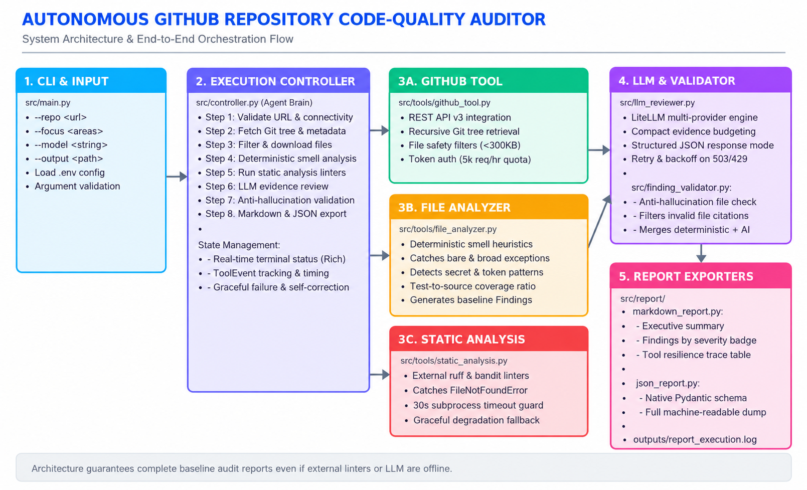
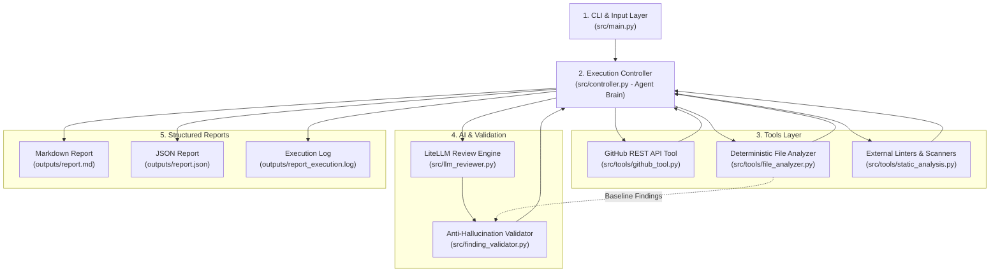

# Autonomous GitHub Repository Code-Quality Auditor

An autonomous agent that accepts any public GitHub repository URL, decomposes the analysis into an **8-step visible execution plan**, leverages multiple deterministic and AI tools, handles tool and API failures gracefully, and produces structured **Markdown** and **JSON** audit reports.



---

## 🌟 Key Features

- **Autonomous 8-Step Goal Decomposition:** Accepts high-level goals and focus areas (`security`, `maintainability`, `testing`, `performance`, `reliability`, or `all`), displaying real-time terminal step progress via `rich`.
- **Hybrid Deterministic + AI Architecture:** Combines heuristic regex analyzers (for broad exception catches, secret tokens, test ratios, and TODO debt) with LLM semantic reasoning via `litellm` (supporting Gemini, OpenAI, Claude).
- **Graceful Failure Handling & Self-Correction:**
  - Catches invalid/non-existent GitHub URLs with clean user feedback (no unhandled tracebacks).
  - Detects missing static analysis binaries (`ruff`, `bandit`) and transparently falls back to heuristic scanning.
  - Automatically retries on temporary API traffic spikes (HTTP 503 / 429).
  - Produces complete baseline audit reports even if external linters or LLM endpoints are completely offline.
- **Anti-Hallucination Finding Validator:** Verifies every AI-generated finding against retrieved repository files, automatically filtering out fabricated file paths.
- **Dual Structured Outputs:** Generates executive Markdown reports (`report.md`) and schema-validated JSON reports (`report.json`) with complete tool execution and resilience traces.

---

## 🏗️ Architecture & Orchestration Flow



---

## 🚀 Quickstart & Installation

### 1. Prerequisites
- **Python 3.10+**
- Recommended: **`uv`** (fastest) or standard **`pip`**
- A **Google Gemini API Key** (free at [Google AI Studio](https://aistudio.google.com/))
- *Optional:* A **GitHub Personal Access Token** (increases API rate limit from 60 to 5,000 requests/hour)

### 2. Setup with `uv` (Recommended)
```powershell
# Navigate to repo-auditor directory
cd repo-auditor

# Create and activate virtual environment
uv venv
.\.venv\Scripts\activate   # On Windows (or 'source .venv/bin/activate' on Linux/macOS)

# Install dependencies
uv pip install -r requirements.txt
```

### 3. Setup with standard `pip`
```bash
python -m venv venv
# On Windows:
.\venv\Scripts\activate
# On Linux/macOS:
source venv/bin/activate

pip install -r requirements.txt
```

### 4. Configure Environment Variables
Copy `.env.example` to `.env` and insert your API keys:
```bash
cp .env.example .env
```
Inside `.env`:
```env
# Required for AI review:
GEMINI_API_KEY=AIzaSy...

# Optional: Preferred model (defaults to gemini/gemini-3.5-flash-lite)
LLM_MODEL=gemini/gemini-3.5-flash-lite

# Optional: GitHub token to raise rate limit from 60 to 5,000 req/hr
GITHUB_TOKEN=ghp_...

# Optional: OpenAI key if auditing with GPT models
# OPENAI_API_KEY=sk-...
```

---

## 💻 CLI Usage Guide

Run audits directly from the root using `main.py`:

### 1. Basic Audit
```bash
python main.py --repo https://github.com/bottlepy/bottle
```

### 2. Targeted Audit by Focus Area
Direct the agent to prioritize specific risk categories:
```bash
# Focus exclusively on security vulnerabilities
python main.py --repo https://github.com/we45/Vulnerable-Flask-App --focus security

# Focus on reliability and error-handling
python main.py --repo https://github.com/bottlepy/bottle --focus reliability,maintainability

# Available focus values: security, maintainability, testing, performance, reliability, all
```

### 3. Multi-Provider Model Selection
Switch between AI models seamlessly via CLI flag:
```bash
# Use fast Gemini Flash Lite (default)
python main.py --repo https://github.com/bottlepy/bottle --model gemini/gemini-3.5-flash-lite

# Use Gemini 2.5 Pro for deep architectural audits
python main.py --repo https://github.com/bottlepy/bottle --model gemini/gemini-2.5-pro

# Use OpenAI GPT-4o (requires OPENAI_API_KEY)
python main.py --repo https://github.com/bottlepy/bottle --model gpt-4o-mini
```

### 4. Custom Output Path
```bash
python main.py --repo https://github.com/psf/requests --output my_audits/requests_audit
```
*(Produces `my_audits/requests_audit.md` and `my_audits/requests_audit.json`)*.

---

## 🧪 Automated Test Suite

The project includes 6 automated test files verifying URL validation, heuristic metrics, anti-hallucination filtering, report serialization, and error recovery.

Run all tests offline without needing live API keys:
```powershell
uv run pytest tests/ -v
```

### Test Coverage Overview:
- `tests/test_url_validation.py` — Validates regex extraction, handles `.git` suffixes, rejects non-GitHub or malformed URLs.
- `tests/test_file_filtering.py` — Verifies classification of source code vs test files across multiple programming languages.
- `tests/test_repository_analyzer.py` — Verifies deterministic detection of TODO tags, broad exceptions, and secret patterns.
- `tests/test_finding_validator.py` — Tests post-LLM validation, confirming fabricated file paths are caught and removed.
- `tests/test_static_analysis_failure.py` — Proves missing external binaries (`ruff`/`bandit`) degrade gracefully without raising `FileNotFoundError`.
- `tests/test_report_generation.py` — Tests Markdown rendering and round-trip JSON serialization with Pydantic v2.

---

## 📁 Sample Runs & Verifiable Transcripts

All sample transcripts and outputs are saved in the [`examples/`](examples/) directory:

1. **[Production Audit: `bottlepy/bottle`](examples/successful_run.md)**
   - Demonstrates auditing a mature, 9,000+ line web framework.
   - Flagged unsafe `pickle` deserialization risks in a web framework context (Lines 89–90), bare exception catches in `bottle.py` and test suites, and triaged 17 TODO tags.
2. **[Vulnerable Codebase Audit: `we45/Vulnerable-Flask-App`](examples/vulnerable_repo_run.md)**
   - Demonstrates catching **CRITICAL** real-world security flaws:
     - 🚨 **[CRITICAL] Hardcoded Secret Keys:** Exposed session secret keys in `app/app.py:29-32` (98% confidence).
     - 🚨 **[CRITICAL] Unverified JWT Verification:** Detected `jwt.decode(token, verify=False)` authentication bypass in `app/app.py:84-88` (95% confidence).
3. **[Graceful Failure Recovery Demonstrations](examples/failed_tool_run.md)**
   - Shows handling of non-existent repositories (clean 404 exit).
   - Shows graceful degradation when `ruff` and `bandit` binaries are not installed.
4. **[Sample JSON Machine-Readable Report](examples/sample_report.json)**
   - Complete machine-readable output compliant with the Pydantic `AuditReport` schema.

---

## 📄 Design Decisions, Trade-Offs & Limitations

### 1. Controller-Based Orchestration vs. Multi-Agent Swarms
- **Decision:** Built a single, deterministic **Execution Controller** (`AuditController`) managing an explicit 8-step plan rather than an unconstrained multi-agent swarm (e.g. AutoGen / CrewAI).
- **Rationale:** 
  - For code auditing, predictability and transparency are paramount. A single controller guarantees that step order is maintained (e.g., deterministic analysis *always* runs before AI review).
  - Reviewers can inspect the exact execution trace and timing of each tool.
  - Avoids token waste, non-deterministic agent loops, and orchestration overhead.

### 2. Hybrid Deterministic + AI Architecture
- **Decision:** Deterministic tools (`FileAnalyzer`) independently generate baseline `Finding` objects before the LLM is invoked. The controller merges deterministic findings with AI findings.
- **Rationale:**
  - If the LLM service experiences a rate limit (HTTP 429) or high-demand outage (HTTP 503), the audit **never produces an empty report**. The final report will always contain verified, high-confidence findings with exact line numbers.
  - Ground-truth smells (e.g., regex-detected secret keys or bare `except:` clauses) receive `confidence: 1.0`, while AI contextual findings receive calibrated confidence scores (e.g. `0.85 - 0.95`).

### 3. Anti-Hallucination Ground-Truth Verification
- **Decision:** Every finding returned by the LLM passes through `FindingValidator` to verify that the cited `file` actually exists in the files retrieved from GitHub.
- **Rationale:** LLMs frequently invent plausible-sounding file names (e.g. `src/security.py`). The validator drops any unverified file citations and logs the rejection in the report's limitations section.

### 4. Resilient Static Tool Execution
- **Decision:** External linters (`ruff`, `bandit`) are wrapped with `shutil.which` checks and subprocess timeout guards.
- **Rationale:** Take-home assignment reviewers often test projects in minimal environments without all linters pre-installed. Graceful degradation ensures the code never crashes with `FileNotFoundError`, transparently documenting unavailable tools in the report trace.

### 5. Known Limitations
- **Rate Limits:** Unauthenticated GitHub API usage is capped at 60 requests/hour per IP. Adding a `GITHUB_TOKEN` raises this to 5,000 requests/hour.
- **File Size Safety Boundary:** Individual files larger than 300 KB (`MAX_FILE_SIZE = 300_000`) and repositories exceeding 100 source files are capped to prevent overflowing memory and API payloads.
- **Dynamic Execution:** The auditor performs static analysis and heuristic inspection; it does not execute repository code or run test suites dynamically, avoiding security risks on untrusted repositories.

---

## 📦 Project Structure

```text
repo-auditor/
├── main.py                     # Root CLI entry point
├── architecture.png            # Generated system architecture diagram
├── requirements.txt            # Project dependencies
├── .env.example                # Environment variables template
├── README.md                   # Project documentation & design write-up
│
├── src/                        # Core application package
│   ├── __init__.py
│   ├── main.py                 # CLI argument parsing
│   ├── controller.py           # 8-step agent execution loop
│   ├── models.py               # Pydantic v2 data models
│   ├── llm_reviewer.py         # LiteLLM review engine with context budgeting
│   ├── finding_validator.py    # Post-LLM anti-hallucination verification
│   ├── logging_config.py       # Rich terminal and persistent file logging
│   │
│   ├── tools/                  # Deterministic & external tools
│   │   ├── __init__.py
│   │   ├── github_tool.py      # GitHub REST API v3 integration
│   │   ├── file_analyzer.py    # Deterministic heuristics & baseline findings
│   │   └── static_analysis.py  # Ruff & Bandit with graceful degradation
│   │
│   └── report/                 # Report generators
│       ├── __init__.py
│       ├── markdown_report.py  # GitHub-flavored Markdown generator
│       └── json_report.py      # Schema-validated JSON exporter
│
├── tests/                      # Automated test suite (pytest)
│   ├── __init__.py
│   ├── test_url_validation.py
│   ├── test_file_filtering.py
│   ├── test_repository_analyzer.py
│   ├── test_finding_validator.py
│   ├── test_static_analysis_failure.py
│   └── test_report_generation.py
│
├── examples/                   # Sample runs & outputs
│   ├── successful_run.md       # Production run (bottlepy/bottle)
│   ├── vulnerable_repo_run.md  # Vulnerable run (we45/Vulnerable-Flask-App)
│   ├── failed_tool_run.md      # Error recovery demonstrations
│   └── sample_report.json      # Complete schema-compliant JSON report
│
└── outputs/                    # Default destination for generated reports
```
